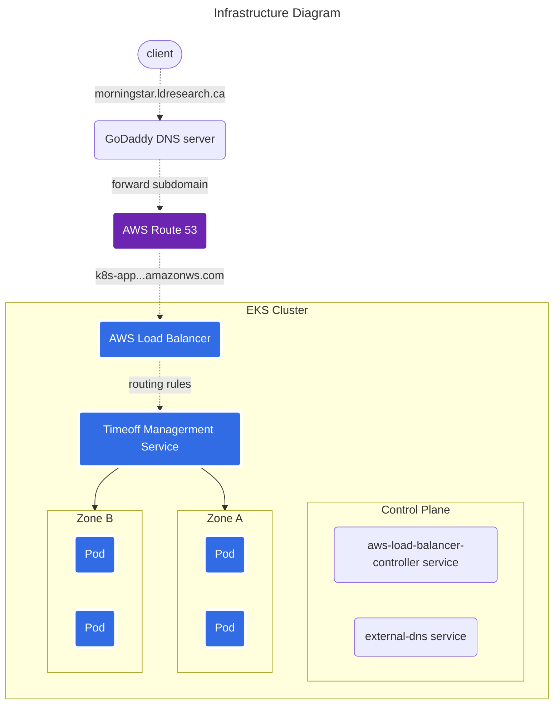

# Luong Dang's Technical Assessment for Morningstar



## Features

1. The application is deployed at a friendly domain name: [`morningstar.ldresearch.ca`](https://morningstar.ldresearch.ca/login/), not `k8s-app-...-ca-central-1.elb.amazonws.com`. I own the `ldresearch.ca` domain and use a subdomain for this project.

2. `HTTP` is automatically redirected to `HTTPS`:

```bash
curl -IL http://morningstar.ldresearch.ca    # 1. call HTTP endpoint
# Output
HTTP/1.1 301 Moved Permanently
Server: awselb/2.0  # this response came from AWS EKS Load Balancer
Date: Wed, 22 Feb 2023 11:56:36 GMT
Content-Type: text/html
Content-Length: 134
Connection: keep-alive
Location: https://morningstar.ldresearch.ca:443/    # 2. redirect to HTTPS

HTTP/2 302 
date: Wed, 22 Feb 2023 11:56:36 GMT
content-type: text/plain; charset=utf-8
content-length: 30
location: ./login/    # 3. redirect to login page
x-powered-by: Express
vary: Accept

HTTP/2 200    # 4. success
date: Wed, 22 Feb 2023 11:56:36 GMT
content-type: text/html; charset=utf-8
content-length: 7141
x-powered-by: Express
etag: W/"1be5-AkT3wXYoY/B76qPi5F7v+b/XNqE"
```

3. The application is HA, with auto-scaling between 2 and 10 pods, which are strategically load-balanced across two different availability zones:

```yml
# app/timeoff-management.yml
spec:
  topologySpreadConstraints:
    - maxSkew: 1
      whenUnsatisfiable: ScheduleAnyway
      topologyKey: zone
      labelSelector:
      matchLabels:
        app: timeoff-management
```

Verify that running pods are indeed located in different availability zones:

```bash
# List the pods running the Timeoff Management app
kubectl get pods -o json \
    | jq '
        .items[] 
        | select(.metadata.name | startswith("timeoff-management"))
        | {podName: .metadata.name, hostIP: .status.hostIP}
    '
# Output:
{
  "podName": "timeoff-management-5c8544cb95-kklfc",
  "hostIP": "192.168.50.226"
}
{
  "podName": "timeoff-management-5c8544cb95-mth5r",
  "hostIP": "192.168.11.164"
}

###
# Find where they are located 
aws ec2 describe-instances \
    --filters Name=private-ip-address,Values=192.168.50.226,192.168.11.164 \
    | jq '.Reservations[].Instances[] | {
        hostIP: .PrivateIpAddress,
        availabilityZone: .Placement.AvailabilityZone
      }'
# Output
{
  "hostIP": "192.168.50.226",
  "availabilityZone": "ca-central-1b"
}
{
  "hostIP": "192.168.11.164",
  "availabilityZone": "ca-central-1a"
}
```

4. CI/CD pipelines that are triggered automatically upon a push to the `main` branch. 
    * [`pipelines/cluster.yml`](pipelines/clustrer.yml): update the EKS cluster. It has 3 execution modes: `update` (default) will update the existing cluster; `create` will deploy a new cluster; `delete` will remove the cluster from AWS.
    * [`pipelines/app.yml`](pipelines/app.yml): update the app deployment inside the cluster.

The pipelines are executed by [Azure Devops](https://dev.azure.com/ldresearch0987/Morningstar/_build).

5. Diagram-as-code: the diagram at top was rendered from code by [Mermaid](https://mermaid.js.org/). View the Raw version of this page for details.

## Challenges

* The cluster provisioning relies on `eksctl`. While very helpful, the utility is still in pre-release. It has drift-detection, but limit ability to readjust them. Many times, I had to delete and recreate the full cluster which was a time-consuming process.

* Getting a TLS certificate for the HTTPS endpoint was challenging. The cluster uses the AWS Load Balancer, which only works with certs in the Amazon Certificate Manager (ACM). I had to manually extract the cert from EKS and import it to ACM. The `annotations` on AWS Ingress were also bewildering, for example:

```yml
# app/ingress.yml
annotations:
  # Where do these come from and what do they mean?
  # Took me a while to get to their documentation
  alb.ingress.kubernetes.io/listen-ports: '[{"HTTP": 80}, {"HTTPS":443}]'
  alb.ingress.kubernetes.io/certificate-arn: arn:aws:acm:ca-central-1:...
```

* The cert was issued by Let's Encrypt and only valid for 1 month. The `cert-manager` service in the EKS cluster is can handle renewal automatically. However, as the cluster requires manual intervention to get the cert to Amazon Certificate Manager, it will become a hassle in the future. I will investigate other load balancers (NGINX comes to mind) to see if there's an easier solution.

* Coming from the Azure cloud, I had limited exposure to AWS. It was often exciting, sometimes frustrating but always exhilarating to experience a new cloud platform.
